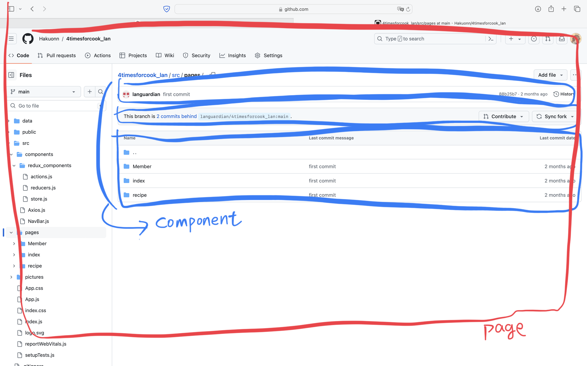

# 四時煮食食｜剩食x健康食譜

## 版本更新｜0717
我已經將img的網址更新了，當Axios Server有變更時記得除了Axios.js外也要去App.js修改。
更新如下（範例）：
當你的頁面需要用到後端儲存的圖片網址：
```react
APP.js
原：
<Route path='/Menu' element={<MenuPage} />
修改成：
<Route path='/Menu' element={<MenuPage baseUrl={baseUrl}/>} />
```
```react
MenuPage.js
原：
最一開始的地方 function MenuPage() 
修改成：
function MenuPage({ baseUrl }) 


在需要圖片的地方修改成：
<Card.Img variant="top" src={`${baseUrl}${pic}`} />
```

### 0717特別說明
在App.js裡面有註解掉的Route是Brian能力不足無法debug也沒時間debug的部份，裡面"極有可能"是有重大錯誤才沒去做修正。<br/><br/>
各位麻煩請依照06/11會議資料裡所分配的工作負責人依照自己的情況去啟用，並且去DC裡面的github連結(也就是ecobaoFront不然就是4timesforcook_lan: ㄚㄚㄚㄚㄚ)抓取原始檔去做修正。<br/><br/>
那些註解並不是壞掉！！就只是沒有去做啟用！！🙂‍↔️🙂‍↔️<br/><br/>以上<br/><br/>
我覺得我打得很清楚了，還有不清楚的地方煩請在群組求解，謝！


## 純凈版

pages分成兩大類：食譜recipe & 剩食訂購uberEat。需要添加功能請依照資料夾放。
Components：
* nav_and_footer
放置所有navBar跟footer的
* uberEat_C_C(剩食訂購_compnent_Customer)
* uberEat_C_S(剩食訂購_compnent_Store)
* recipe_C(食譜_Component)

## 命名規則

如果是頁面，請在檔名後面加page並且放置在pages相對應的資料夾，ex:StoreOrderPage.js。<br/>
如果是component，則不用加並放置在components相對應的資料夾，ex:ProductItem.js
### 例如

所以要怎麼放呢？
就會像這樣：
```python
└── src
    ├── App.css
    ├── App.js
    ├── components
    │   ├── Component1.js
    │   ├── Component2.js
    │   └── Component3.js
    └── pages
        └── GithubPage.js
```
而GithubPage.js裡面會長這樣：

```react
import React from 'react'
import Component1 from '../components/Component1'
import Component2 from '../components/Component2'
import Component3 from '../components/Component3'


function GithubPage() {
  return (
    <>
        <Component1/>
        <Component2/>
        <Component3/>
    </>
  )
}

export default GithubPage

```

## 目前的tree
```python
└── src
    ├── App.css
    ├── App.js
    ├── components
    │   ├── Axios.js
    │   ├── nav_and_footer
    │   │   ├── Footer.js
    │   │   ├── KanBan.js
    │   │   └── StoreKanBan.js
    │   ├── recipe_C
    │   ├── uberEat_C_C
    │   │   ├── AboutBuilder.js
    │   │   ├── LogIn.js
    │   │   ├── LoginCard.js
    │   │   ├── SimpleSlider.js
    │   │   └── menu
    │   │       ├── EmptyState.js
    │   │       ├── FoodTypeSelect.js
    │   │       ├── GetUserLocation.js
    │   │       ├── Map.js
    │   │       ├── MenuStoreList.js
    │   │       ├── RecommendStore.js
    │   │       └── Search.js
    │   └── uberEat_C_S
    │       ├── EmptyState.js
    │       ├── ProductItem.js
    │       ├── StatusButton.js
    │       └── StoreCancelOrder.js
    ├── css
    │   ├── nav_footer.css
    │   ├── uberEat_customer.css
    │   └── uberEat_store.css
    ├── imgs
    │   ├── ZHJ8C7j.png
    │   ├── gps.png
    │   ├── hold300x300.jpg
    │   ├── lee1.png
    │   ├── logo.png
    │   ├── map.png
    │   ├── read-me1.png
    │   ├── sliders
    │   │   ├── slider1.png
    │   │   ├── slider2.png
    │   │   ├── slider3.png
    │   │   └── slider4.png
    │   ├── storelog.png
    │   └── userlog.png
    ├── index.css
    ├── index.js
    └── pages
        ├── HomePage.js
        ├── NotFoundPage.js
        ├── recipe
        └── uberEat
            ├── customer
            │   ├── AboutMePage.js
            │   ├── CommonQAPage.js
            │   ├── LoginPage.js
            │   ├── MenuPage.js
            │   ├── RegisterPage.js
            │   └── aboutPages
            │       ├── AboutEcobao.js
            │       ├── AboutSd.js
            │       └── AboutVision.js
            └── store
                ├── StoreAddNewMealPage.js
                ├── StoreCustomerFeedbackPage.js
                ├── StoreIndexPage.js
                ├── StoreLoginPage.js
                ├── StoreMealEdit.js
                ├── StoreOrderHistoryPage.js
                ├── StoreOrderPage.js
                ├── StoreProductPage.js
                └── StoreRegisterPage.js
```